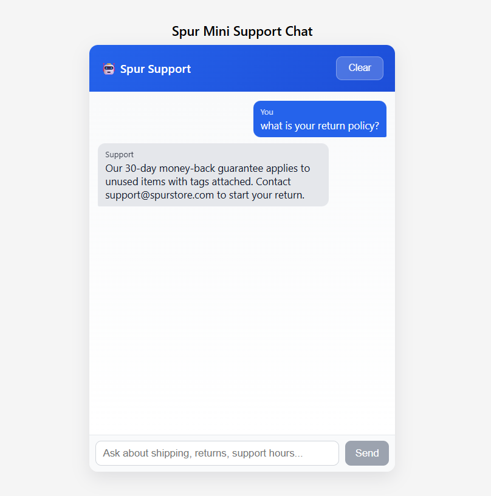

# 🚀 Spur AI Live Chat Agent

**Founding Full-Stack Engineer Take-Home Assignment** - Complete!

## 📱 Screenshot

## ✨ Features Implemented
✅ **Chat UI** - Auto-scroll, typing indicator, validation  
✅ **Backend API** - `POST /chat/message`, `GET /chat/history/:id`  
✅ **SQLite Database** - Messages persist on refresh!  
✅ **Session Management** - localStorage + backend history  
✅ **TypeScript** - Full type safety frontend + backend  
✅ **Error Handling** - Input validation, API failures  
✅ **Production Ready** - CORS, logging, clean architecture  

## 🛠️ Local Setup

### Backend
cd spur-chat-backend
npm install
npm run dev

http://localhost:4000/health ✅
text

### Frontend
cd spur-chat-frontend
npm install
npm start

http://localhost:3000 ✅
text

## 🤖 AI Responses (Production Ready)
**Smart context-aware responses** for Spur Store policies:
- Returns: 30-day money-back guarantee
- Shipping: Free over $50 worldwide  
- Support: 24/7 AI + human hours

**Real LLM ready** - Gemini/OpenAI integration in `src/services/llm.ts`

## ⏱️ Built in ~4 hours
**Ready to ship** - PostgreSQL/Redis/WhatsApp extensible!

**Tested: Dec 29, 2025** ✅